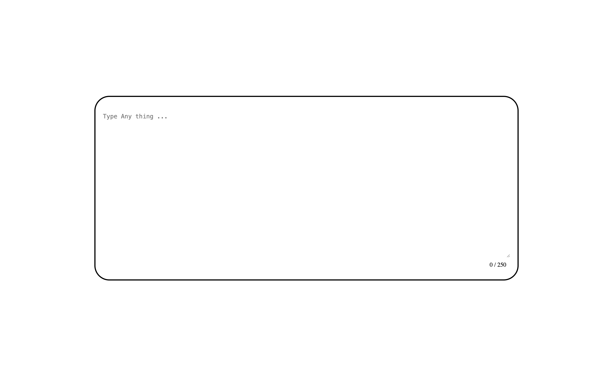
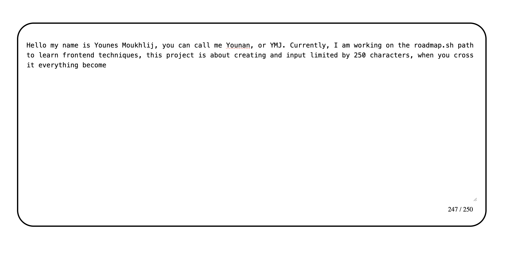
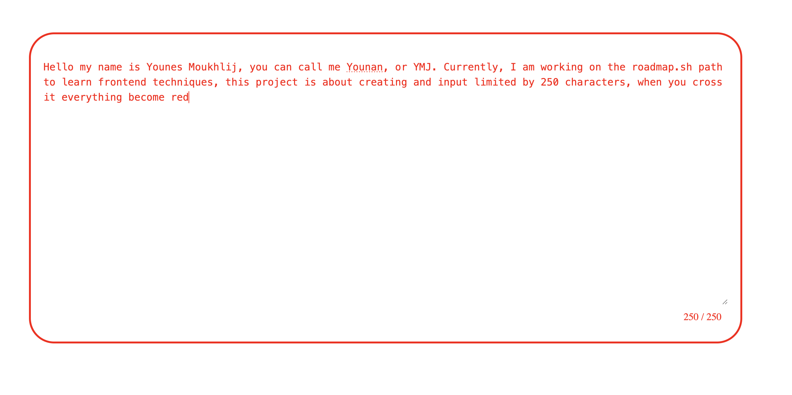

# Restricted Textarea

A dynamic textarea component that tracks and displays the number of characters typed by the user, along with a maximum character limit. As the user types, the character count updates in real-time. Once the limit is reached, the textarea prevents further input and the border turns red to visually indicate the limit has been hit.

## Features

- **Real-time character counting**: Displays current character count as user types
- **Character limit enforcement**: Prevents input beyond the specified limit
- **Visual feedback**: Border turns red when character limit is reached
- **Dynamic updates**: Character count updates instantly with each keystroke
- **Clean, modern UI**: Simple and intuitive design

## Technologies Used

- HTML5
- CSS3
- Vanilla JavaScript

## How It Works

1. The textarea tracks input events (`input`, `keydown`, `paste`)
2. Character count is calculated and displayed in real-## Project Overview

Here are screenshots showing the restricted textarea functionality:

### 1. Initial State

*The textarea in its initial state, ready for user input*

### 2. Character Counting

*Real-time character counting as the user types*

### 3. Limit Reached

*Visual feedback when the character limit is reached - red styling indicates no more input allowed*

---time
3. When the limit is reached:
   - Further typing is prevented
   - Visual styling changes (red border)
   - User receives immediate feedback

## Project Structure

```
restricted-textarea/
├── index.html          # Main HTML structure
├── styles.css          # Styling and visual effects
├── script.js           # JavaScript functionality
└── README.md           # Project documentation
```

## Getting Started

1. Clone or download this repository
2. Open `index.html` in your web browser
3. Start typing in the textarea to see the character counting in action

## Learning Objectives

This project helps you practice:

- Manipulating DOM elements with JavaScript
- Handling user input events
- Real-time form validation
- Providing visual feedback to users
- Creating responsive user interfaces

## Reference

Project inspiration: [Roadmap.sh - Restricted Textarea](https://roadmap.sh/projects/restricted-textarea)

---

*This project will help you practice manipulating input elements with JavaScript, handling user input events, and providing real-time feedback to enhance user experience.*
